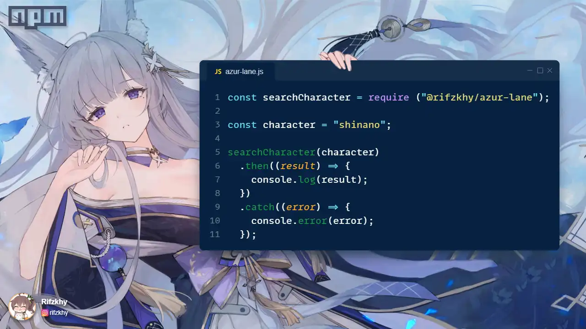

# Azur Lane


Scrape Azur Lane ship girl information from [Azurlane WIKI](https://azurlane.koumakan.jp/)

## Installation

```bash
npm install @rifzkhy/azur-lane
```

## Example

```javascript
const searchCharacter = require ("@rifzkhy/azur-lane");

const character = "shinano";

searchCharacter(character)
  .then((result) => {
    console.log(result);
  })
  .catch((error) => {
    console.error(error);
  });

```

## Output

```json
{
  url: 'https://azurlane.koumakan.jp/w/index.php?search=shinano',
  banner: 'https://azurlane.netojuu.com/images/4/42/ShinanoBanner.png',
  skin: 'https://azurlane.netojuu.com/images/2/2f/ShinanoShipyardIcon.png',
  chibi: 'https://azurlane.netojuu.com/images/5/5f/ShinanoChibi.png',
  faction: 'https://azurlane.netojuu.com/images/thumb/e/e5/Jp_1.png/326px-Jp_1.png',
  category: 'https://azurlane.netojuu.com/images/thumb/6/61/CV_img0.png/49px-CV_img0.png',
  voice: 'https://azurlane.netojuu.com/images/7/7f/Shinano_TitleScreenJP.ogg',
  name: 'Shinano',
  title: 'IJN Shinano',
  info: {
    rarity: 'Ultra Rare ★★★★★★',
    construction: '05:15:00',
    class: 'Yamato',
    faction: 'Sakura Empire',
    category: 'Aircraft Carrier',
    voice: 'Mamiko Noto',
    illustrator: '侑了个侑',
    drop: "Available in Limited Construction during the Dreamwaker's Butterfly event"
  },
  techpoint: {
    collection: '26',
    maxlimitbreak: '52',
    level120: '39',
    total: '117'
  },
  limitbreak: {
    first: 'Slot 2 Planes +1 / Dive Bomber Efficiency +5% / Can Equip Dive Bombers/Torpedo Bombers in the Fighters slot',
    second: 'Hangar Capacity +1 / Slot 3 Planes +2 / Torpedo Bomber Efficiency +10%',
    third: 'All Aircraft +1 / All Plane Efficiency +5%'
  },
  skills: {
    skill1: {
      icon: 'https://azurlane.netojuu.com/images/d/d8/Skill_13580.png',
      name: "Hope's Tempest",
      description: "3s after the battle starts: launches a Saiun recon flight. When this ship launches an Airstrike: launches an additional Lv.1 (Lv.10) Shiden Kai 2, Ryuusei, Shinano launches all three airstrikes Saiun airstrike. Saiuns do not attack, but decrease the FP, TRP, AVIIngame doesn't mention this, and AA of one random enemy (humanoids prioritized) by 3% and increase the damage they take by 3% until the battle ends. This debuff can stack up 
to three times."
    },
    skill2: {
      icon: 'https://azurlane.netojuu.com/images/8/8b/Skill_13590.png',
      name: "Dreamwaker's Bow[Operation Siren]",
      description: "Every 15s: fires a Lv.1 (Lv.10) special barrage. During the 1st and 2nd battles this ship fights in during a sortie: increases this 
ship's AVI by 5% (15%). When the fleet this ship is NOT in starts its 3rd, 4th, or 5th battles of a sortie, launches a Lv.1 (Lv.10) airstrike (DMG is based on the skill's level) 15s after the battle starts. [Operation Siren] Every 15s: fires a Lv.1 (Lv.10) special barrage. During the 1st and 2nd battles this ship fights in during a sortie: increases this ship's AVI by 5% (15%). When a fleet this ship is NOT in starts its 3rd or 4th battles of a sortie: fires a Lv.1 (Lv.10) barrage (DMG is based on the skill's level) 15s after the battle starts. [This skill's sortie battle counter resets when moving to a new area or changing your formation within Operation Siren.]"
    },
    skill3: {
      icon: 'https://azurlane.netojuu.com/images/2/20/Skill_13600.png',
      name: 'Protector of the New Moon',
      description: "While this ship is afloat: increases the FP, EVA, and ASW of your DDs by 5% (15%). If the fleet this ship is in contains 3 (or more) Sakura Empire ships: decreases this ship's DMG taken from Main Guns and Aircraft by 10% (20%) and increases AVI and Accuracy by 5% (15%) for all your Sakura Empire CVs and CVLsIn-game only mentions CVs, but IJN CVLs are also affected by this buff."
    },
    skill4: { icon: '', name: '', description: '' },
    skill5: { icon: '', name: '', description: '' },
    skill6: { icon: '', name: '', description: '' }
  }
}
```

## License [MIT](https://github.com/Rifzkhy/azur-lane/blob/main/LICENSE)